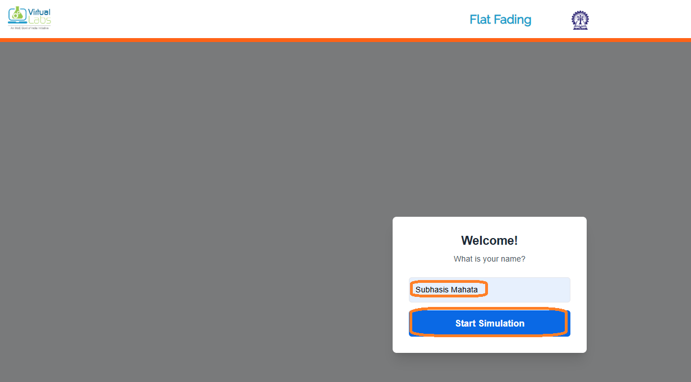
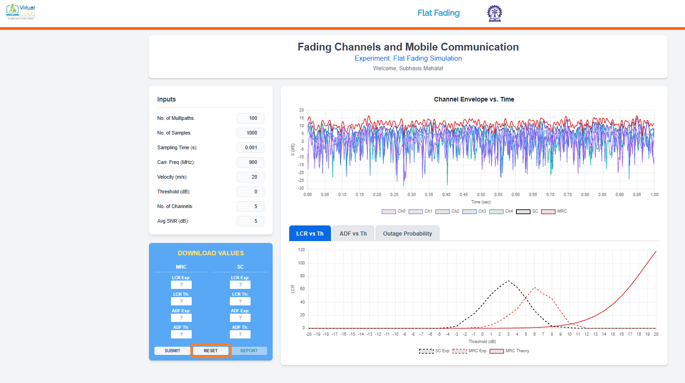
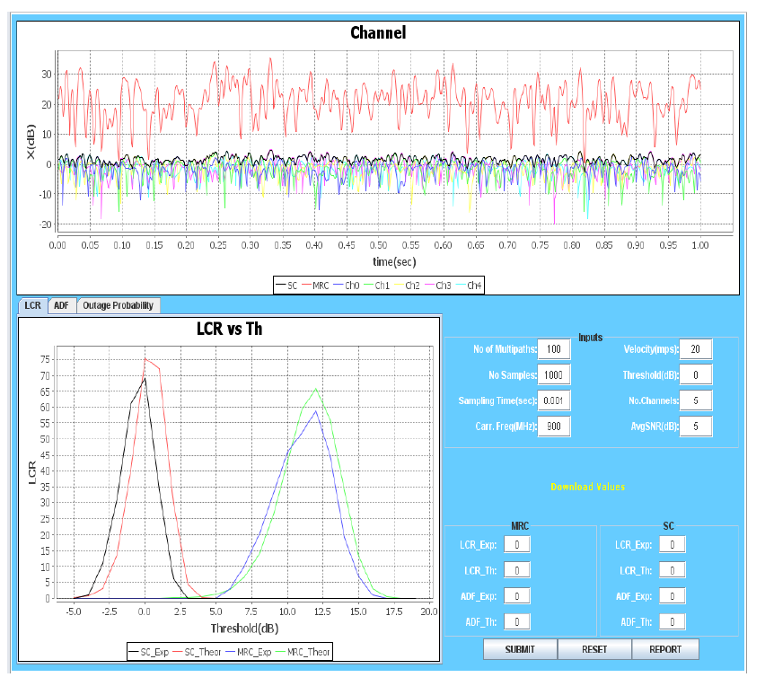
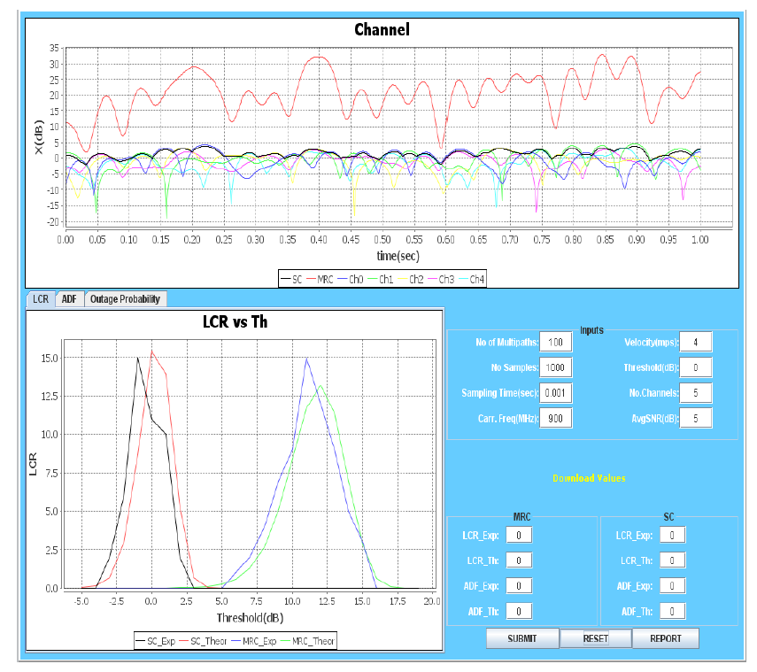
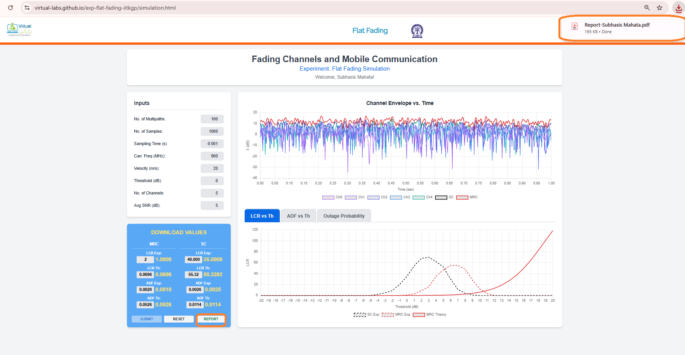
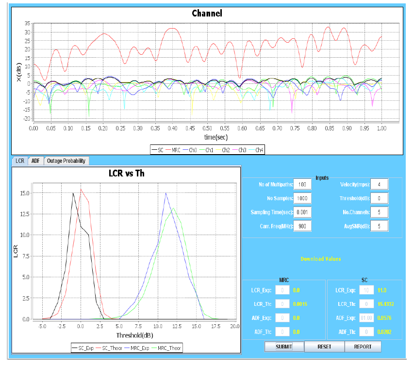
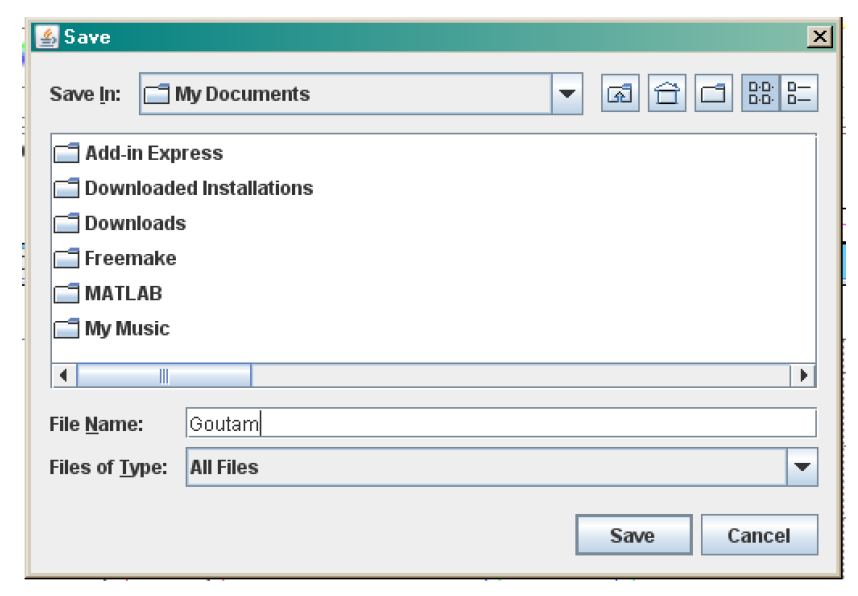
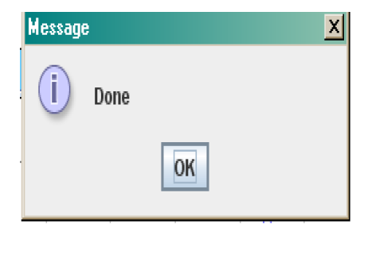
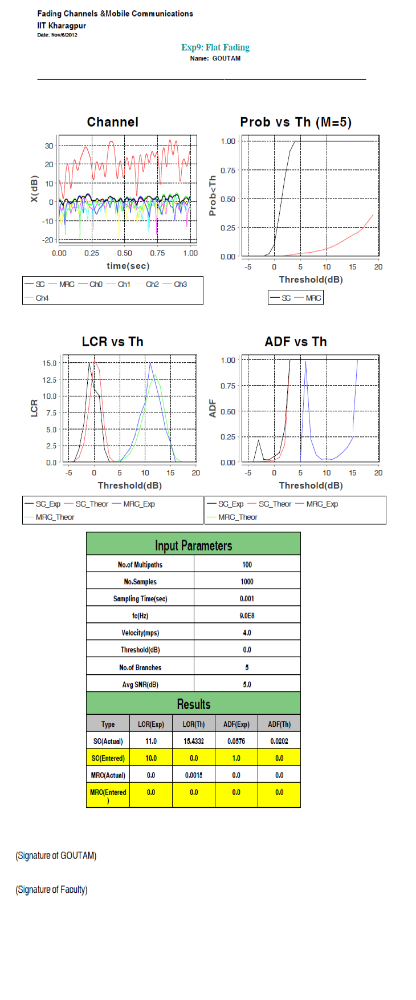

## Procedure

Follow the instructions given below to perform the experiments:-

* Step1:- Click on the button START. A page appears with a dialogue box asking for your name.

   

      
      

* Step 2:- Enter your name then Click Ok.

  

      
      

   

      
      

* Step3:- Enter the input parameters value. Then click on "RESET" Button.Observed the waveform.

   

      
      

* Step4:- Enter value of LCR Exp and ADF Exp in both MRC and SC from the waveform.Then Click on "SUBMIT" Button.

   

      
      

* Step5:- Click on the "Report" button.

   

      
      

* Step6:- PDF report of the experiment is generated.

    

      
      

* Step7:-After generation of the Report you will get following message.

    

      
      

* Step8:- Click on the "Ok" and you will get your Report.

    

      
      

* Step9:- To Redo the experiment click on "RESET" button.
* 
    
